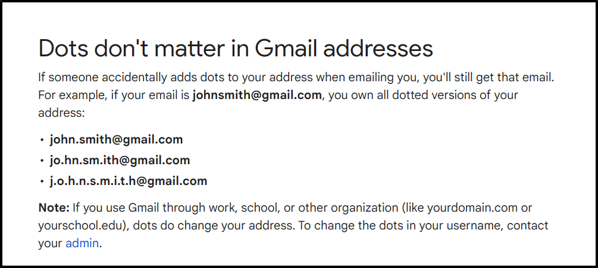
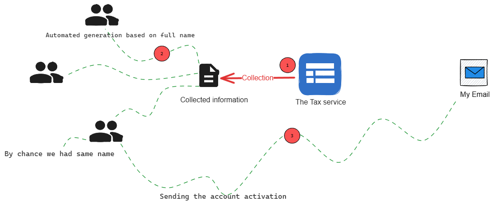

# Dots in the Shadows - Unraveling the Gmail Loophole

  

In 2015, as I sat at my laptop sifting through emails, one particular message caught my eye. It was from a well-known government tax system, which was puzzling since I'd never registered with them. I was underage and a student at the time, so why would I be involved with taxes?

Upon closer inspection, the email wasn’t a scam; it genuinely originated from that organization. The message enclosed a formal letter, addressed to me by both my first and last names, and contained a link for account activation on their platform.

Curiosity piqued, I clicked the link and was promptly directed to a page prompting me to set up a new password - a standard procedure for first-time account activation. After setting my password, I was ushered into the dashboard. To my astonishment, the profile was pre-filled with details, as though the account had been auto-generated using pre-existing data. But the catch? The details weren't mine.

The full name matched, but the birth year was 1979, and the profile claimed I was married with four children. Moreover, the address was foreign to me.

  

A whirlwind of questions stormed my mind. Could there be someone in my county with an identical name? It seemed improbable but not impossible. But then, why was the activation email sent to me? Was it an error?

Digging deeper, I revisited the profile's email address. It read: Name(.)Lastname@gmail.com, strikingly similar to my own email, which was NameLastname@gmail.com. The only difference? A single dot between the name and surname.

This discovery dismissed the notion of a simple clerical error. It wasn't my email on the account, so why was I receiving these notifications? Out of curiosity, I attempted to reset the password for that account to see if the validation code would come to my email. And, to my astonishment, it did!

But how could this be? What made this seemingly different email address redirect to my personal inbox?
Honestly I had no Ideas till i found this :

  

This phenomenon is known as canonicalization. It's the process of converting data into a standard, normalized format. This practice is prevalent in programming to manage and streamline varied input formats that might otherwise lead to issues.

I suspect Gmail employs this canonicalization to combat fraud and identity theft. Without this system in place, impersonation would be much simpler. For instance, one could pose as John Smith using the email john.smith.@gmail.com, which could easily be mistaken for the legitimate john.smith@gmail.com by those familiar with the latter.

Before diving into how this feature could potentially be exploited, let's first understand why I received that email:

  

Firstly, the tax service appears to gather individual data, possibly through various methods. The crucial point is that after this data collection, they construct user profiles on their platform. They then generate email addresses for these accounts based on the user's first and last name, separated by a DOT.

By sheer coincidence, one of their users shared my name. Consequently, an email was created based on this name. Unfortunately for them (and rather perplexingly for me), I had already registered with that exact email address. Due to Gmail's unique feature, I ended up being the recipient of notifications intended for that individual.

Clear enough, now lets use the hacker mind set and discover how this feature can be abused 

  

Now that we understand Gmail doesn't differentiate between dot placements in email addresses, it becomes clear that example@gmail.com, exma.ple@gmail.com, and e.x.a.m.p.l.e@gmail.com all direct to the same inbox. This realization opens up potential avenues for misuse:

## Circumventing Bans and Restrictions
Suppose you have an account on a platform using example@gmail.com and, for some reason, you're banned. Does this mean the end of your access? Not necessarily. Many platforms implement their ban mechanisms based on the exact string of the email address. So while example@gmail.com might be blacklisted, exma.ple@gmail.com might not be. By simply adding a DOT in a different position, you could potentially create a new account. Ironically, this new "distinct" email still points to the same original inbox, allowing you to bypass the ban.

And if you're wondering whether such vulnerable platforms still exist today: take a look at fiverr.com :p

## Free Netflix subscription:
Take Netflix as another example. When you sign up on their platform, they don't immediately request email verification. Instead, they prompt you to enter payment details and allow you to dive right into their vast collection of TV shows.

Imagine using an email like EddieMorra@gmail.com, which belongs to an active user. If you were to register with Eddie.Morra@gmail.com, Netflix might permit this because it's unaware of Gmail's DOT feature. Consequently, you've essentially created an account linked to someone else's email. You could then initiate a free trial using a fictitious card number. Once Netflix completes its card verification and you subsequently cancel it, you can let the trial period run its course.

When the trial ends, Netflix will send an email requesting an update to the payment details. The twist? This email won't land in your inbox cause simply you have no acces; the actual owner of EddieMorra@gmail.com will receive it. For them, this email may seem entirely legitimate, and they might update the payment details. Now, you have access to a paid Netflix account. Since you never verified the email associated with this account, you could change it, effectively hijacking the account and its payment details indefinitely.

You can check this amazing article about a scam using this technique : [The dots do matter: how to scam a Gmail user (jameshfisher.com)](https://jameshfisher.com/2018/04/07/the-dots-do-matter-how-to-scam-a-gmail-user/)

##Conclusion
In our digital age, it's often the smallest details, like a simple dot, that reveal the most significant vulnerabilities. As we embrace technology's conveniences, we must remain vigilant, ensuring that such nuances don't become gateways to unintended consequences.
